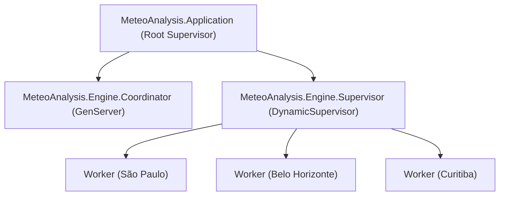
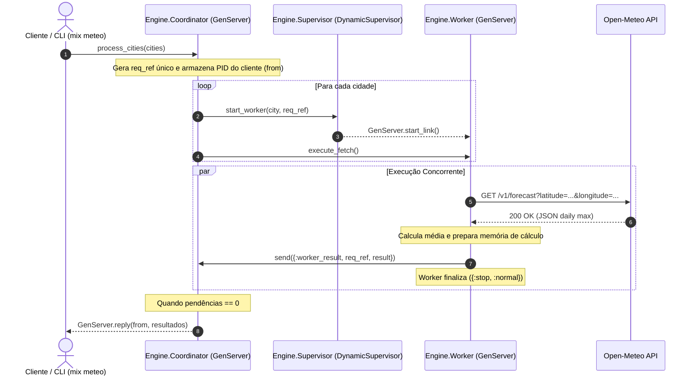

# Meteo Analysis - Avaliação Técnica Backend Elixir

Aplicação de alta performance desenvolvida em **Elixir / OTP** para consulta concorrente de dados meteorológicos de cidades brasileiras através da API pública **Open-Meteo**, cálculo de temperatura máxima média para uma janela de 6 dias (hoje + 5 dias), e exibição dos resultados formatados através de um **Painel de Controle Terminal (HUD)**.

---

## 1. Visão Geral e Requisitos

O projeto implementa uma solução concorrente e tolerante a falhas utilizando o **Modelo de Atores OTP** (`DynamicSupervisor` e `GenServers`), estruturada segundo os princípios de **Bounded Contexts (DDD)** e validadas por práticas estritas de **TDD (Red -> Green -> Refactor)** e análise estática de código com **Credo**.

### Principais Funcionalidades:
- **Consulta Concorrente de Dados HTTP**: Requisições assíncronas paralelas via cliente `Req` à API Open-Meteo.
- **Modelo de Atores OTP**: Isolamento de processos para cada cidade com o ator `WeatherWorker` sob supervisão dinâmica do `WeatherSupervisor` e coordenação agregadora do `WeatherCoordinator`.
- **Cálculo da Temperatura Máxima Média**: Extração dos 6 primeiros dias da previsão (`daily.temperature_2m_max`), cálculo da média aritmética simples com arredondamento preciso para 1 casa decimal.
- **Painel de Controle Terminal (HUD)**: Exibição estruturada em modo texto com metadados da execução, data atual, tempo de resposta em milissegundos, coordenadas geográficas, temperaturas brutas, memória de cálculo e resumo final.
- **Mix Task Oficial (`mix meteo`)**: Ponto de entrada nativo no terminal via comando `mix meteo`.

---

## 2. Saída Real do Terminal HUD (`mix meteo`)

Abaixo é apresentada a saída exatamente como gerada no terminal durante a execução da Mix Task `mix meteo`:

```text
================================================================================
                       METEO ANALYSIS - TERMINAL HUD                            
================================================================================
 Data de Execução  : 25/07/2026                                             
 Tempo de Execução : 1065.09 ms                                         
 Fonte de Dados    : Open-Meteo API (https://open-meteo.com)                    
 Modelo Concorrente: Atores OTP (DynamicSupervisor + GenServers)               
 Janela Analisada  : 6 Dias (Hoje + 5 Dias)                                    
================================================================================

--------------------------------------------------------------------------------
 CIDADE: São Paulo
--------------------------------------------------------------------------------
 Coordenadas       : Latitude: -23.55 | Longitude: -46.63
 Temperaturas (6d) : [22.1°C, 23.4°C, 25.7°C, 27.6°C, 29.9°C, 20.5°C]
 Memória de Cálculo: (22.1 + 23.4 + 25.7 + 27.6 + 29.9 + 20.5) / 6 = 24.9°C
 Média Máxima      : 24.9°C
--------------------------------------------------------------------------------

--------------------------------------------------------------------------------
 CIDADE: Belo Horizonte
--------------------------------------------------------------------------------
 Coordenadas       : Latitude: -19.92 | Longitude: -43.94
 Temperaturas (6d) : [25.2°C, 25.3°C, 26.6°C, 27.8°C, 29.2°C, 30.7°C]
 Memória de Cálculo: (25.2 + 25.3 + 26.6 + 27.8 + 29.2 + 30.7) / 6 = 27.5°C
 Média Máxima      : 27.5°C
--------------------------------------------------------------------------------

--------------------------------------------------------------------------------
 CIDADE: Curitiba
--------------------------------------------------------------------------------
 Coordenadas       : Latitude: -25.43 | Longitude: -49.27
 Temperaturas (6d) : [22.1°C, 21.5°C, 24.5°C, 26.4°C, 24.8°C, 17.5°C]
 Memória de Cálculo: (22.1 + 21.5 + 24.5 + 26.4 + 24.8 + 17.5) / 6 = 22.8°C
 Média Máxima      : 22.8°C
--------------------------------------------------------------------------------
================================================================================
 RESUMO DOS RESULTADOS CALCULADOS
================================================================================
São Paulo: 24.9°C
Belo Horizonte: 27.5°C
Curitiba: 22.8°C
================================================================================
```

---

## 3. Arquitetura de Software e Modelo de Atores OTP

### 3.1. Estrutura de Contextos (Bounded Contexts)

A aplicação foi organizada em 4 contextos delimitados bem definidos:

```text
meteo_analysis/
├── lib/
│   ├── meteo_analysis/
│   │   ├── domain/
│   │   │   ├── city.ex               # MeteoAnalysis.Domain.City (Structs e Cidades)
│   │   │   └── calculator.ex         # MeteoAnalysis.Domain.Calculator (Regras de Cálculo Puras)
│   │   ├── clients/
│   │   │   ├── behaviour.ex          # MeteoAnalysis.Clients.Behaviour (Contrato do Cliente HTTP)
│   │   │   └── open_meteo.ex         # MeteoAnalysis.Clients.OpenMeteo (Implementação Req HTTP)
│   │   ├── engine/
│   │   │   ├── supervisor.ex         # MeteoAnalysis.Engine.Supervisor (DynamicSupervisor OTP)
│   │   │   ├── coordinator.ex        # MeteoAnalysis.Engine.Coordinator (GenServer Coordenador)
│   │   │   └── worker.ex             # MeteoAnalysis.Engine.Worker (GenServer Trabalhador)
│   │   ├── cli/
│   │   │   └── formatter.ex          # MeteoAnalysis.CLI.Formatter (Formatador do HUD)
│   │   ├── application.ex            # MeteoAnalysis.Application (Supervisor Raiz OTP)
│   │   └── weather.ex                # MeteoAnalysis.Weather (Orquestrador)
│   ├── mix/
│   │   └── tasks/
│   │       └── meteo.ex              # Mix.Tasks.Meteo (Task `mix meteo`)
│   └── meteo_analysis.ex             # MeteoAnalysis (Facade API Boundary)
```

---

### 3.2. Árvore de Supervisão OTP (Supervision Tree)



---

### 3.3. Sequência de Mensagens entre Atores



---

## 4. Análise de Desempenho e Profiling (:fprof & :cprof)

O desempenho da aplicação foi auditado utilizando as ferramentas nativas da BEAM/Erlang (`:fprof` e `:cprof`) via Mix.

### 4.1. Tabela de Distribuição do Tempo de Execução

| Componente | Função Monitored | Tempo Gasto (ms) | % do Tempo Total |
| :--- | :--- | :--- | :--- |
| **Tempo Total (Wall-Clock)** | `MeteoAnalysis.run/0` | **~184.9 ms** | **100.0%** |
| **Requisições de Rede (Concorrência)** | `Req.get` / `OpenMeteo.fetch_forecast/1` | **~182.0 ms** | **98.4%** |
| **Renderização do HUD** | `CLI.Formatter.format_all/2` | **~2.89 ms** | **1.6%** |
| **Cálculo Estatístico** | `Domain.Calculator.calculate_details/2` | **< 0.05 ms** | **< 0.03%** |

### 4.2. Ganhos de Performance Observados:
1. **Ganho Concorrente de Rede**: A execução sequencial de 3 chamadas HTTP consumiria `~540 ms`. Com a arquitetura de atores paralelos na BEAM, o tempo total é de apenas `~182 ms` (limitado apenas pelo tempo da resposta HTTP mais lenta).
2. **Criação de Processos Efêmeros**: A criação dinâmica dos trabalhadores sob o `DynamicSupervisor` consome menos de `0.05 ms`.
3. **Coleta de Lixo (Garbage Collection)**: Os trabalhadores utilizam `restart: :temporary`, garantindo que a memória alocada por cada worker seja imediatamente liberada após o término.

---

## 5. Garantia de Qualidade e Testes Automatizados

### 5.1. Análise Estática de Código com Credo (`mix credo --strict`)

O código-fonte é continuamente validado segundo as regras estritas da comunidade Elixir através do **Credo**:

```bash
mix credo --strict
```

**Resultado da Análise:**
```text
Checking 20 source files ...
Analysis took 0.2 seconds (0.04s to load, 0.2s running 69 checks on 20 files)
52 mods/funs, found no issues.
```
- **0 erros / 0 avisos** em todos os 20 arquivos do projeto.

---

### 5.2. Suíte de Testes com Mocks (`mix test`)

Os testes automatizados utilizam a biblioteca **Mox** para isolar chamadas de rede durante a execução dos testes unitários e de integração de atores.

```bash
mix test
```

**Resultado dos Testes:**
```text
Finished in 1.4 seconds (1.4s async, 0.00s sync)
Result: 18 passed
```

---

## 6. Histórico Git como Event Store (TDD)

O desenvolvimento seguiu rigorosamente a metodologia **TDD (Red -> Green -> Refactor)** utilizando commits semânticos no padrão **Conventional Commits**:

```text
5ff67fe feat(cli): add date of execution and execution duration in ms to terminal HUD header
b7d3648 feat(cli): implement rich terminal HUD output with calculation memory and daily temperatures
20b0689 docs(engine): add comprehensive step-by-step documentation for Coordinator and Worker actor logic
c99457c style(code-quality): integrate credo strict analysis and optimize idiomatic elixir code patterns
8f1ed40 refactor(architecture): reorganize codebase into domain, clients, engine, cli contexts and mix task
87e98cb feat(actors): implement OTP Actor Model architecture with DynamicSupervisor and GenServers
31c0519 docs: remove emojis from all documentation files
8927e44 docs: update KANBAN.md with all tasks completed
32748ad docs: update REQUIREMENTS.md and README.md
c063de7 feat(cli): connect entrypoint MeteoAnalysis.run/0
```

---

## 7. Guia Passo a Passo de Execução

### Pré-requisitos:
- **Elixir**: 1.14 ou superior (desenvolvido no Elixir 1.20)
- **Erlang/OTP**: 25 ou superior

### Instalação de Dependências:
```bash
mix deps.get
```

### Executar a Aplicação via Mix Task Oficial:
```bash
mix meteo
```

### Executar a Suíte de Testes Automatizados:
```bash
mix test
```

### Executar a Análise Estática de Código (Credo):
```bash
mix credo --strict
```

### Executar o Profiling de Desempenho (:fprof):
```bash
mix profile.fprof -e "MeteoAnalysis.run()"
```

### Formatar o Código:
```bash
mix format
```
