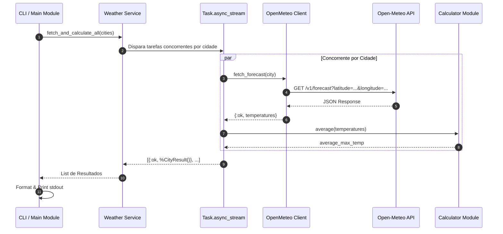

# Especificação de Requisitos e Documentação Técnica
## Avaliação Técnica – Backend Elixir (Meteo Analysis)

---

## 1. Visão Geral do Projeto

O objetivo deste projeto é desenvolver uma aplicação backend em **Elixir** que consulte concorrentemente a previsão do tempo para 3 cidades brasileiras (**São Paulo**, **Belo Horizonte** e **Curitiba**) através da API pública **Open-Meteo**, processe os dados de temperatura dos próximos 6 dias (hoje + 5 dias), calcule a temperatura máxima média de cada cidade e exiba o resultado consolidado e formatado no terminal.

O foco principal do desenvolvimento é demonstrar:
* **Estruturação limpa e idiomática de código Elixir**.
* **Uso eficiente de concorrência** (`Task`, `Task.async_stream` ou Abstrações OTP).
* **Conceitos de Programação Funcional** (funções puras, imutabilidade, pipelines `|>`, pattern matching).
* **Tratamento de erros e resiliência** (expressão `with`, fallbacks).
* **Estratégia sólida de testes** unitários e de integração utilizando mocks para a API HTTP externa.
* **Metodologia TDD (Red -> Green -> Refactor)** com **Git atuando como Event Store** por meio de commits semânticos granulares.

---

## 2. Requisitos do Sistema

### 2.1. Requisitos Funcionais (RF)

| ID | Nome | Descrição |
| :--- | :--- | :--- |
| **RF-001** | **Consulta à API Open-Meteo** | O sistema deve realizar chamadas HTTP `GET` para a API da Open-Meteo obtendo a lista `temperature_2m_max` para o período de 6 dias (hoje + 5 dias). |
| **RF-002** | **Execução Concorrente** | As requisições HTTP para as cidades configuradas devem ser executadas de forma **concorrente e assíncrona**, otimizando o tempo total de resposta. |
| **RF-003** | **Cálculo da Temperatura Máxima Média** | O sistema deve extrair os primeiros 6 valores do array `daily.temperature_2m_max` e calcular a média aritmética simples para cada cidade. |
| **RF-004** | **Exibição de Resultados** | O sistema deve exibir os resultados na saída padrão (stdout) com os nomes das cidades e os valores calculados formatados com 1 casa decimal e sufixo `°C`. |
| **RF-005** | **Suporte às Cidades Especificadas** | O sistema deve conter as coordenadas padrão configuradas: <br> • **São Paulo**: Lat `-23.55`, Long `-46.63`<br> • **Belo Horizonte**: Lat `-19.92`, Long `-43.94`<br> • **Curitiba**: Lat `-25.43`, Long `-49.27` |

### 2.2. Requisitos Não-Funcionais (RNF)

| ID | Nome | Descrição |
| :--- | :--- | :--- |
| **RNF-001** | **Concorrência Idiomática (BEAM)** | O processamento concorrente deve utilizar as primitivas nativas da BEAM/Elixir (`Task.async_stream` ou `Task.async/await`), evitando bloqueios desnecessários. |
| **RNF-002** | **Arquitetura e Separação de Responsabilidades** | O código deve separar claramente as responsabilidades: Cliente HTTP, Regras de Negócio/Cálculo, Formatação/CLI e Mapeamento de Dados. |
| **RNF-003** | **Tratamento de Erros e Fault Tolerance** | Falhas de rede ou retornos inválidos da API devem ser tratados graciosamente usando Pattern Matching e a sintaxe `with`, sem derrubar a aplicação abruptamente. |
| **RNF-004** | **Testabilidade e Isolamento de HTTP** | A suíte de testes deve utilizar Mocks (ex: `Mox` ou `Req.Test`/`Bypass`) para isolar chamadas de rede externas e garantir testes determinísticos e rápidos. |
| **RNF-005** | **Desenvolvimento Dirigido a Testes (TDD)** | O projeto deve ser desenvolvido estritamente seguindo o ciclo **TDD (Red -> Green -> Refactor)**. |
| **RNF-006** | **Git como Event Store & Commits Semânticos** | Cada fase do TDD e evolução funcional deve ser registrada como um evento imutável no Git com mensagens no padrão **Conventional Commits**. |

---

## 3. Especificação do Endpoint Externo (Open-Meteo API)

### HTTP Request
* **Método:** `GET`
* **Base URL:** `https://api.open-meteo.com/v1/forecast`
* **Parâmetros da Query:**
  * `latitude` (float): Latitude geográfica da cidade.
  * `longitude` (float): Longitude geográfica da cidade.
  * `daily` (string): `temperature_2m_max`
  * `timezone` (string): `America/Sao_Paulo`

### Exemplo de Requisição (São Paulo):
```http
GET https://api.open-meteo.com/v1/forecast?latitude=-23.55&longitude=-46.63&daily=temperature_2m_max&timezone=America/Sao_Paulo HTTP/1.1
```

### Exemplo de Resposta (JSON):
```json
{
  "latitude": -23.55,
  "longitude": -46.63,
  "generationtime_ms": 0.123,
  "utc_offset_seconds": -10800,
  "timezone": "America/Sao_Paulo",
  "timezone_abbreviation": "-03",
  "elevation": 760.0,
  "daily_units": {
    "time": "iso8601",
    "temperature_2m_max": "°C"
  },
  "daily": {
    "time": [
      "2024-04-21",
      "2024-04-22",
      "2024-04-23",
      "2024-04-24",
      "2024-04-25",
      "2024-04-26"
    ],
    "temperature_2m_max": [28.5, 29.3, 27.1, 26.8, 29.0, 30.3]
  }
}
```

---

## 4. Arquitetura e Design de Software em Elixir

### 4.1. Fluxo de Dados e Processamento



### 4.2. Estrutura Modular Recomendada do Projeto

```text
meteo_analysis/
├── config/
│   ├── config.exs          # Configurações gerais da aplicação
│   └── test.exs            # Configuração de Mocks para ambiente de testes
├── lib/
│   ├── meteo_analysis/
│   │   ├── city.ex          # Struct para representação da Cidade (nome, lat, lon)
│   │   ├── calculator.ex    # Funções puras de cálculo estatístico (média)
│   │   ├── client/
│   │   │   ├── behaviour.ex # Behaviour para cliente da API (permite Mock)
│   │   │   └── open_meteo.ex# Implementação real do cliente HTTP (Req ou Finch/HTTPoison)
│   │   ├── weather.ex       # Orquestrador da concorrência (Task.async_stream)
│   │   └── formatter.ex     # Formatação gráfica da saída no terminal
│   ├── meteo_analysis.ex    # Módulo principal / Entry point
│   └── mix/tasks/meteo.ex   # (Opcional) Mix Task para execução simples `mix meteo`
├── test/
│   ├── meteo_analysis/
│   │   ├── calculator_test.exs
│   │   ├── weather_test.exs
│   │   └── client/open_meteo_test.exs
│   ├── test_helper.exs
│   └── mocks/               # Definições de Mocks (Mox)
├── .formatter.exs
├── mix.exs                  # Dependências (req, mox, jason, etc.)
└── README.md
```

---

## 5. Estratégia de Desenvolvimento TDD (Red -> Green -> Refactor)

### 5.1. O Ciclo TDD
O desenvolvimento segue rigorosamente os três passos do TDD para cada unidade funcional:

1. **RED (Teste Falhando)**: Escreve-se o teste unitário/integração com a asserção do comportamento esperado antes de existir a implementação do código de produção. Executa-se `mix test` comprovando que o teste falha (compilação ou asserção).
2. **GREEN (Teste Passando)**: Implementa-se a menor quantidade de código de produção suficiente para fazer o teste passar.
3. **REFACTOR (Refatoração)**: Melhora-se a estrutura, legibilidade e performance do código (eliminando duplicações e aplicando idiotismos funcionais do Elixir), mantendo a suíte de testes passando.

```mermaid
graph TD
    A["RED: Escrever teste falhando em test/"] --> B["`mix test` falha (Esperado)"]
    B --> C["GREEN: Implementar código mínimo em lib/"]
    C --> D["`mix test` passa (Sucesso)"]
    D --> E["REFACTOR: Refatorar código mantendo testes verdes"]
    E --> F["Commit Git Semântico do Evento"]
    F --> A
```

---

## 6. Git como Event Store & Commits Semânticos

### 6.1. Conceito do Git como Event Store
O repositório Git é tratado como um **Event Store imutável e auditável**. Cada commit representa um **evento atômico de evolução do software** (uma transição de estado da aplicação). 

Isso garante:
* **Rastreabilidade Histórica**: Qualquer desenvolvedor ou avaliador pode visualizar a construção linha por linha do projeto via `git log`.
* **Transparência na Evolução**: Fica visível o exato momento em que o teste foi criado (RED), corrigido (GREEN) e refatorado (REFACTOR).

### 6.2. Convenção de Mensagens (Conventional Commits)

Formatos aceitos:
* `test(<escopo>): <descrição> [RED]`
* `feat(<escopo>): <descrição> [GREEN]`
* `refactor(<escopo>): <descrição> [REFACTOR]`
* `docs(<escopo>): <descrição>`
* `chore(<escopo>): <descrição>`

### 6.3. Cronograma de Commits como Eventos (Roteiro Completo)

Abaixo está o roteiro de eventos de commits executado durante o desenvolvimento:

| Evento # | Fase TDD | Commit Message (Conventional Commit) | Descrição da Ação no Código |
| :---: | :---: | :--- | :--- |
| **01** | `CHORE` | `chore: initialize elixir project with mix new` | Criação da estrutura base com `mix new meteo_analysis`. |
| **02** | `CHORE` | `chore(deps): add req, jason and mox dependencies` | Adição de dependências HTTP e Mocks no `mix.exs`. |
| **03** | `RED` | `test(city): add test for default cities struct [RED]` | Escreve teste para validação de coordenadas das 3 cidades. |
| **04** | `GREEN` | `feat(city): implement City struct and default coordinates [GREEN]` | Cria o módulo `MeteoAnalysis.City`. |
| **05** | `RED` | `test(calculator): add tests for average calculation of max temps [RED]` | Cria os testes em `calculator_test.exs` cobrindo 6 dias e edge cases. |
| **06** | `GREEN` | `feat(calculator): implement calculate_average/2 [GREEN]` | Implementa a lógica matemática no módulo `Calculator`. |
| **07** | `REFACTOR`| `refactor(calculator): optimize pipeline using Enum.take and Float.round [REFACTOR]` | Refatora o cálculo para código funcional imutável. |
| **08** | `RED` | `test(client): define client behaviour and contract test with Mox [RED]` | Define o módulo `Behaviour` e o teste usando `Mox`. |
| **09** | `GREEN` | `feat(client): implement OpenMeteo client using Req [GREEN]` | Implementa `Client.OpenMeteo` consumindo o endpoint real. |
| **10** | `RED` | `test(weather): add test for concurrent processing of cities [RED]` | Cria teste em `weather_test.exs` mockando o cliente HTTP. |
| **11** | `GREEN` | `feat(weather): implement process_cities/2 using Task.async_stream [GREEN]` | Implementa o orquestrador concorrente em `MeteoAnalysis.Weather`. |
| **12** | `REFACTOR`| `refactor(weather): improve error handling with pattern matching and timeouts [REFACTOR]` | Trata falhas e timeouts no `Task.async_stream`. |
| **13** | `RED` | `test(formatter): add test for output string formatting [RED]` | Escreve teste para formatação `"São Paulo: 28.5°C"`. |
| **14** | `GREEN` | `feat(formatter): implement output console formatter [GREEN]` | Implementa o módulo `Formatter` de exibição. |
| **15** | `FEAT` | `feat(cli): connect entrypoint MeteoAnalysis.run/0` | Conecta os módulos e exibe o resultado final no terminal. |
| **16** | `DOCS` | `docs: update REQUIREMENTS.md and README.md` | Finaliza documentação com guia de execução e testes. |

---

## 7. Estratégia de Mocks para API HTTP

### Abordagem com `Mox`

1. **Definição de Behaviour (`MeteoAnalysis.Client.Behaviour`)**:
```elixir
defmodule MeteoAnalysis.Client.Behaviour do
  @callback fetch_forecast(MeteoAnalysis.City.t()) :: {:ok, [float()]} | {:error, term()}
end
```

2. **Configuração no `test_helper.exs`**:
```elixir
Mox.defmock(MeteoAnalysis.ClientMock, for: MeteoAnalysis.Client.Behaviour)
```

3. **Exemplo de Teste de Integração/Serviço**:
```elixir
defmodule MeteoAnalysis.WeatherTest do
  use ExUnit.Case, async: true
  import Mox

  alias MeteoAnalysis.{City, Weather, ClientMock}

  setup :verify_on_exit!

  test "calcula corretamente as médias para as cidades de forma concorrente" do
    city = %City{name: "São Paulo", latitude: -23.55, longitude: -46.63}

    expect(ClientMock, :fetch_forecast, fn ^city ->
      {:ok, [28.5, 29.3, 27.1, 26.8, 29.0, 30.3]}
    end)

    results = Weather.process_cities([city], ClientMock)

    assert [{:ok, "São Paulo", 28.5}] = results
  end
end
```

---

## 8. Formato Final de Saída do Console

A execução da aplicação (`MeteoAnalysis.run()`) deve imprimir a lista com o padrão especificado:

```text
São Paulo: 28.5°C
Belo Horizonte: 27.8°C
Curitiba: 22.1°C
```

---

## 9. Instruções de Desenvolvimento e Entrega

### 9.1. Inicialização do Projeto Elixir
```bash
mix new meteo_analysis
cd meteo_analysis
```

### 9.2. Principais Dependências Sugeridas (`mix.exs`)
```elixir
defp deps do
  [
    {:req, "~> 0.5.0"},       # Cliente HTTP moderno e leve para Elixir
    {:jason, "~> 1.4"},       # Parser JSON rápido
    {:mox, "~> 1.1", only: :test} # Library standard para Mocks baseados em Behaviour
  ]
end
```

### 9.3. Comandos Úteis
* **Instalar dependências:** `mix deps.get`
* **Rodar os testes:** `mix test`
* **Executar a aplicação:** `mix run -e "MeteoAnalysis.run()"` ou `iex -S mix`
* **Verificar formatação de código:** `mix format --check-formatted`

### 9.4. Checklist para Envio / Code Review
- [x] Repositório público no GitHub com histórico de commits limpo e descritivo.
- [x] Histórico de commits demonstrando o fluxo TDD (Red -> Green -> Refactor).
- [x] README.md com instruções claras de como compilar, rodar e testar o projeto.
- [x] Sem pastas de build descartáveis (`_build`, `deps`) no repositório ou arquivo `.zip`.
- [x] Múltiplos testes unitários e de integração (com `Mox`).
- [x] Tratamento gracioso de erros de rede e formato da API.
